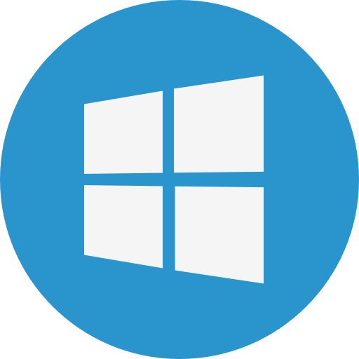
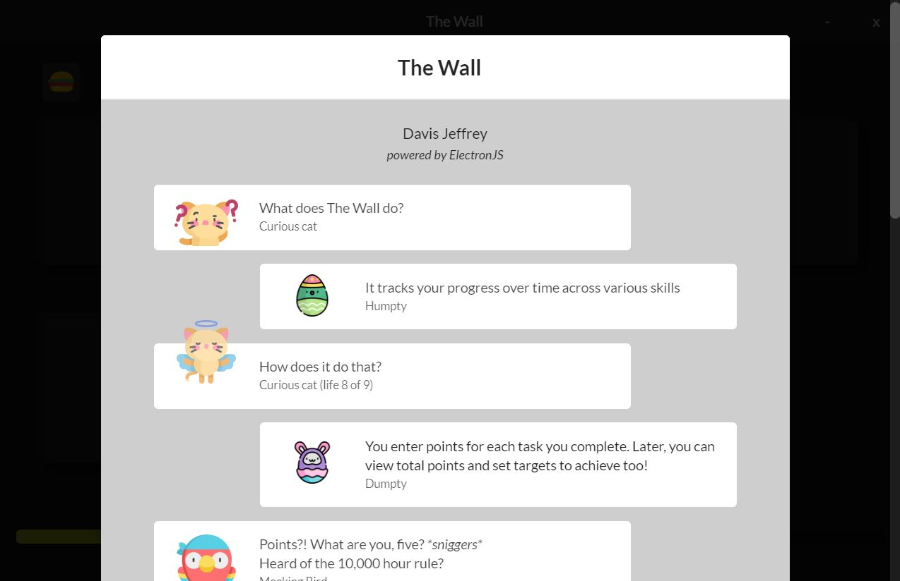
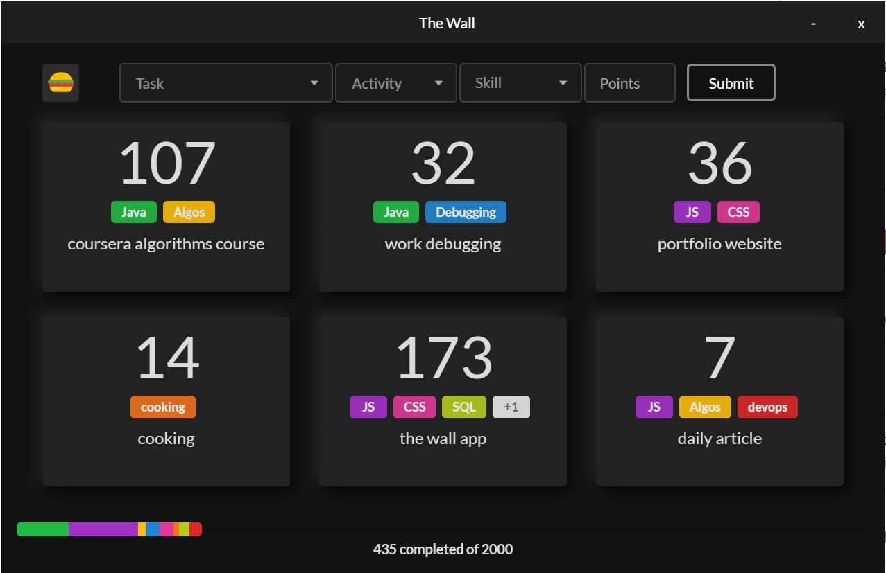
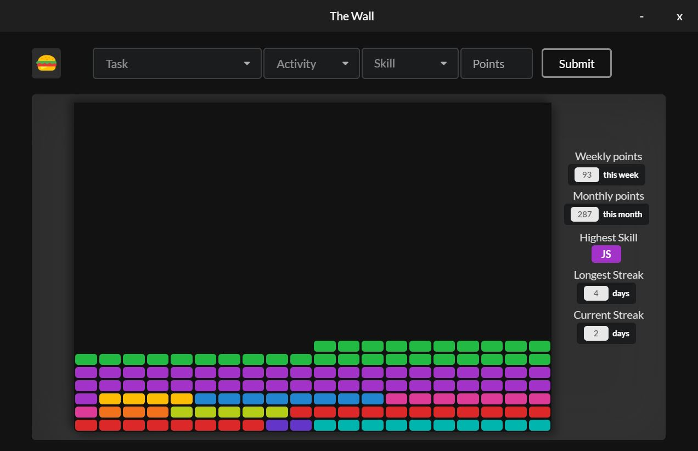
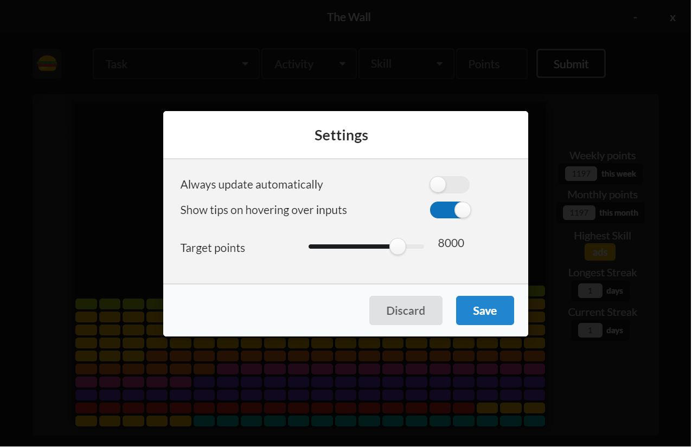
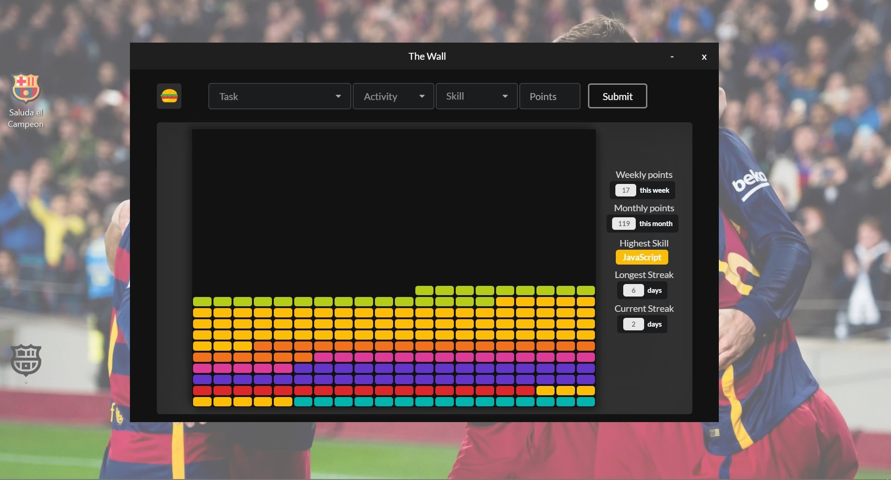

# The Wall

> For bugs or suggestions, feel free to [create an issue](https://gitlab.com/cataxcab/the-wall/-/issues) or drop a mail at catalancabbage@zoho.com

*Click on your OS icon to Download v1.0.0:*  

|Linux|Windows|Mac2|
|:-----:|:----:|:-----:|
||||

*[skip to screenshots](#screenshots)*  

## What is The Wall?
An app to motivate long-term progress and graphically track them across various skills.  

## How does it work?
* When you do something, enter it as a task completed, along with its value and the skill that it helps improve  
* The value of every task you do counts as a *brick* and contributes to building a graphical *wall*  

You can choose your own target value(*points*) and watch The Wall grow as you pen down your tasks!

## Why?
* It's always nice to look back and see how far you've progressed over time in some quantifyable way  
* It also helps you keep going, hopefully giving you a nice hit of dopamine when you add another ~~brick~~ task! 

## The philosophy
Takes inspiration from the 10,000 hour rule1, with a caveat: The time spent alone is a a skewed measure of value  
So for tasks completed, instead of just *time*, quantify it as *points* based on its effort and usefulness  
Also, it's the journey to the number and not the number itself - this aims to help you keep going!

-----

## Specifics!

### Inputs required:
* Task : Specifically whatever you did, like *learnt/did/read something*
* Activity : Grouping of tasks, what is the task a part of? Like *the name of the book/course/routine*, for example
* Skills : Fields in which you've improved by doing the task, like *reading/Java/fitness*, and so on
* Points : Value of the task you did, quantified as a number 

*All previous inputs will be displayed in a dropdown, so you never have to type the same thing twice!*

### The Activity view [:camera:](#activity-view)
* Shows each activity separately, with skills involved and total points
* A progress bar indicates how close you are to your goal(target points)

### The Wall view [:camera:](#wall-view)
* Shows points graphically, with skills indicated by their color  
* Number of total bricks needed to complete the wall is based on target points  
* Stats are displayed on the right, such as streaks, skill with most points, and more

#### Tidbits:
* If you enter one task with Skills *reading* and *writing* with 10 points, 10 points is assigned to *reading* and 10 to *writing*  
So overall, 20 points is added to the total.
* You can set target points anytime from the *Settings* option in the hamburger menu
* There's a helpful *About* section to check out from the hamburger menu!

## Screenshots:

### A helpful 'about' section:
*A moderately-fun read(the first couple of times)*

  

### Activity View:
*Shows each activity as a card, along with total points and skills involved*

  

### Wall view:
*Shows skills as bricks, with some stats; number of bricks is decided by points in that skill*

  

### Target points selection:
*Change your target points anytime*

  

### Scale-ing The Wall:
*Example screenshot to scale: Optimal - not too big, not too small! (ref. resolution: 1920x1080)*

 

-----

1: The idea that it requires 10,000 hours of concentrated practice in order to possess what is considered a world-class skill in something.  
2: The Mac app does not support auto-update; new versions will have to be downloaded from this page.
